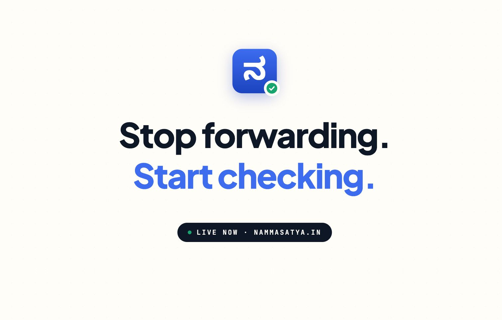

# NammaSatya

[](assets/demo_video.mov)

[Watch the demo video](assets/demo_video.mov)

NammaSatya is a Bengaluru civic fact-checking agent built during a hackathon. It verifies viral WhatsApp or Telegram-style claims against indexed official and trusted local sources, then returns a structured verdict with citations.

The project was originally documented internally as **NammaSatya**. The current repository name and product identity are **NammaSatya**.

Project submission: [Devpost](https://devpost.com/software/nammasatya)

## What It Does

Users paste a civic claim such as a metro shutdown, water cut, road closure, or policy rumor. The backend sanitizes the claim, searches an Elasticsearch index populated from Bengaluru civic/news sources, reranks evidence with Claude on AWS Bedrock, and returns one of four verdicts:

| Verdict | Meaning |
| --- | --- |
| `SUPPORTED` | Indexed sources support the claim |
| `REFUTED` | Indexed sources directly contradict the claim |
| `UNVERIFIED` | No relevant indexed source covers the claim |
| `MANGLED` | A real event exists, but the viral claim distorts scope, timing, or details |

## Repository Layout

```text
.
├── app/
│   ├── backend/             # FastAPI API, agent pipeline, ingestion, tests
│   └── frontend/            # Next.js 15 UI
├── docs/                    # PRD, one-pager, context, implementation notes
├── initial-setup/           # Original Elasticsearch setup script, preserved for reference
└── README.md
```

## Architecture

```text
Raw claim
  -> sanitize()              # strip HTML, normalize whitespace, wrap as untrusted data
  -> extract_query()         # Claude Haiku creates a short search query
  -> hybrid_search()         # Elasticsearch BM25 + ELSER sparse retrieval
  -> rerank()                # Claude Haiku relevance scoring
  -> generate_verdict()      # Claude Sonnet tool-use response
  -> FastAPI response
  -> Next.js UI
```

## Main Apps

- Backend: [app/backend/README.md](app/backend/README.md)
- Frontend: [app/frontend/README.md](app/frontend/README.md)
- Project docs: [docs/README.md](docs/README.md)

## Quick Start

Start the backend:

```bash
cd app/backend
python3 -m venv .venv
. .venv/bin/activate
pip install -r requirements.txt
cp .env.example .env
# fill in Elasticsearch and AWS Bedrock values
python setup.py
uvicorn api:app --host 0.0.0.0 --port 8000 --reload
```

Start the frontend in a second terminal:

```bash
cd app/frontend
npm install
npm run dev
```

Open `http://localhost:3000`.

## Core Data Sources

- Official crawled sources: BMRCL, BBMP, BWSSB, Karnataka.gov, PIB Bengaluru
- RSS sources: The Hindu Bengaluru, The Hindu Karnataka, Citizen Matters

See [docs/PRD.md](docs/PRD.md) and [docs/Context.md](docs/Context.md) for the detailed product and implementation background.
